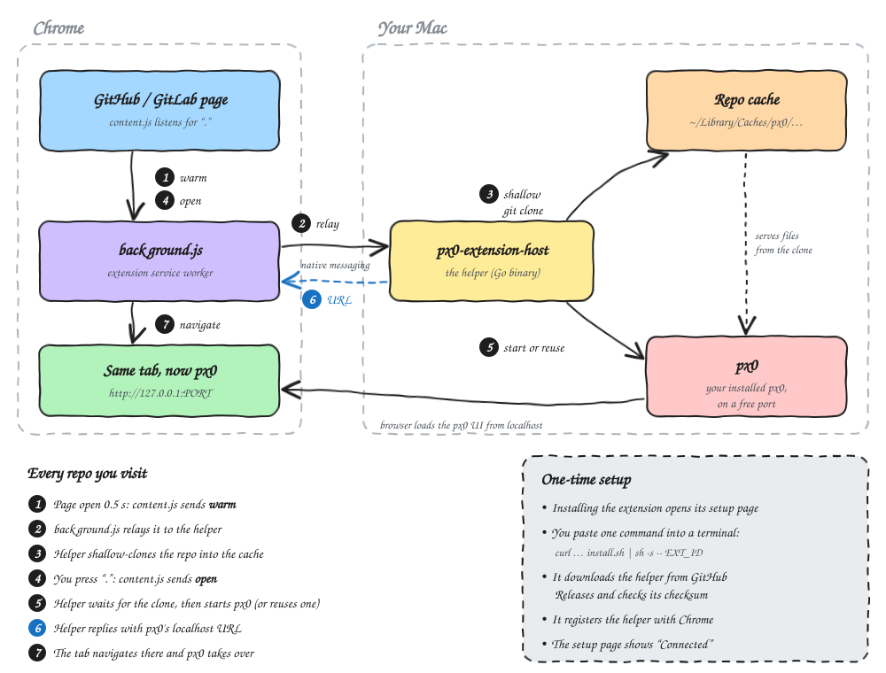

# px0 browser extension

Press `.` on any GitHub or GitLab repository to open it in [px0](https://px0.ai)
on your machine.



## Install

1. Install the extension. A setup page opens.
2. Run the command it shows:

   ```sh
   curl -fsSL https://github.com/dushyant0814/px0-browser-extension/releases/latest/download/install.sh | sh -s -- EXTENSION_ID
   ```

3. The page shows **Connected**. Done.

Works on macOS and Linux with Chrome, Brave, Edge and Arc.

## Develop

```sh
# chrome://extensions → Developer mode → Load unpacked → this folder
./install-host.sh EXTENSION_ID       # build the helper from source and register it
cd host && go test ./...             # run the tests
```

Push a `v*` tag to publish a release.

More detail on the cache, protocol, security and limits:
[docs/browser-extension.md](docs/browser-extension.md).
